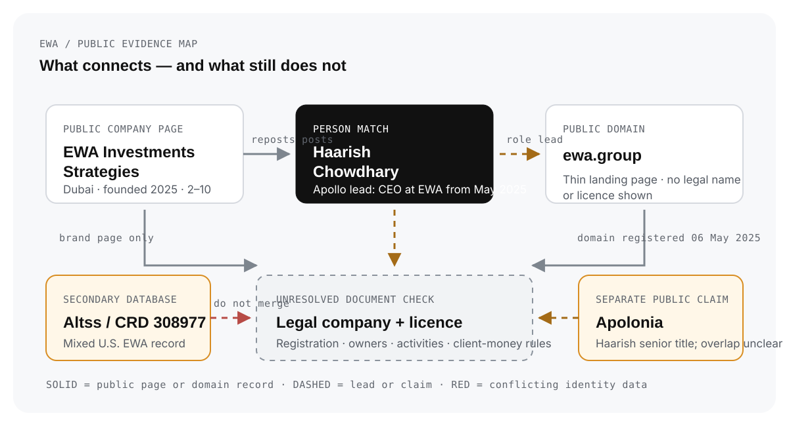

# EWA Investments Strategies — company research

**Research date:** 19 September 2026
**Target:** EWA Investments Strategies / [ewa.group](https://ewa.group/)
**Method:** Apollo lead checks, public company pages, domain records, public media, regulator routes and bounded adverse/review searches. No login wall or private source was bypassed.

## Simple answer

EWA has a **small and recent public footprint**. Its [public LinkedIn company page](https://www.linkedin.com/company/ewa1) describes a Dubai business consulting and services company, says it was founded in 2025, and shows a 2–10 employee range. The [public website](https://ewa.group/) is live, but its home page mainly says “Empowering Business Excellence” and shows a contact form.

The domain itself is new: the public [RDAP record](https://rdap.org/domain/ewa.group) shows registration on **06 May 2025**, and [certificate records](https://crt.sh/?q=ewa.group) show HTTPS certificates from the same date. That proves the domain history, not the legal company, ownership, licence or client work.

Apollo found a strong person match for Haarish and says he is CEO at EWA from May 2025; the safe Apollo result is saved in [`evidence/apollo_ewa_safe.json`](evidence/apollo_ewa_safe.json). But the public [EWA LinkedIn page](https://www.linkedin.com/company/ewa1) lists one visible employee, **Keith Nettles**, and does not list Haarish as an employee. This is a **role/identity conflict**, not proof of wrongdoing.

I found **no exact public result** for a POSH/sexual-harassment case, police case, court case, fraud, scam or lawsuit against the company in the bounded searches linked in the [case search](https://www.google.com/search?q=%22EWA+Investments+Strategies%22+%28lawsuit+OR+court+OR+complaint+OR+fraud+OR+scam%29) and [POSH search](https://www.google.com/search?q=%22EWA+Investments+Strategies%22+%28POSH+OR+%22sexual+harassment%22+OR+harassment+OR+police%29). I also found no named client, completed transaction, independent case study or structured customer/employee review in the [review search](https://www.google.com/search?q=%22EWA+Investments+Strategies%22+%28review+OR+testimonial+OR+feedback+OR+experience%29) and [case-study search](https://www.google.com/search?q=%22EWA+Investments+Strategies%22+%28case+study+OR+client+OR+transaction+OR+deal+OR+portfolio%29). These are search results, **not a clean-record certificate**.

**Practical view:** keep EWA in the **“needs documents”** bucket. Do not send money, investor lists or client data until the exact legal entity, licence, owners, role and past work are proved.

## Status key

- **PUBLICLY REPORTED:** said on a public company/person page; not independently proved.
- **APOLLO LEAD:** useful database lead; Apollo is not an employer or regulator. See the [safe Apollo note](evidence/apollo_ewa_safe.json).
- **VERIFIED DOMAIN RECORD:** checked in a public domain record only.
- **CONTRADICTORY:** two public records do not agree.
- **NOT FOUND IN BOUNDED SEARCH:** no result in the named searches; never read this as “nothing exists.”
- **UNKNOWN:** the public record does not answer the question.

## Evidence map

The diagram keeps four things separate: the [public EWA brand page](https://www.linkedin.com/company/ewa1), the [Apollo person lead](https://www.apollo.io/), the [ewa.group domain](https://ewa.group/) and the still-unknown legal company/licence. The [Altss record](https://altss.com/profile/ewa) is shown as a warning because it mixes Dubai EWA text with U.S. CRD data; the official [SEC/IAPD record](https://adviserinfo.sec.gov/firm/summary/308977) assigns CRD 308977 to a different U.S. EWA firm.

## Company timeline

| Date | What the public record says | Status and link |
|---|---|---|
| **06 May 2025** | `ewa.group` was registered, according to the public RDAP event record. | **VERIFIED DOMAIN RECORD** — [RDAP](https://rdap.org/domain/ewa.group) and [certificate history](https://crt.sh/?q=ewa.group). |
| **2025** | The EWA LinkedIn page says “Founded 2025,” “Privately Held,” “Business Consulting and Services,” and 2–10 employees. | **PUBLICLY REPORTED** — [EWA LinkedIn page](https://www.linkedin.com/company/ewa1). |
| **May 2025 onward** | Apollo records Haarish as CEO at EWA from May 2025. | **APOLLO LEAD** — [safe Apollo note](evidence/apollo_ewa_safe.json); confirm with an employer or appointment document. |
| **20 February 2026** | UAE Stories published a favorable profile/interview describing Haarish as CEO and Strategic Advisor at EWA and repeating advisory, wealth-tech, M&A, family-office and India–UAE claims. | **PUBLICLY REPORTED** — [UAE Stories profile](https://uaestories.com/haarish-chowdhary-architecting-wealthtech-independence-and-global-industrial-synergy/); not a client reference or audited case study. |
| **19 September 2026** | The captured public company page still showed one visible employee, Keith Nettles, while reposting Haarish’s public posts. | **CONTRADICTORY / PUBLICLY REPORTED** — [EWA LinkedIn page](https://www.linkedin.com/company/ewa1). |

**What this timeline does not prove:** company incorporation date, trade licence date, legal owner, regulated activity, client assets, revenue, completed deals or a legal Haarish directorship. The [official Dubai licence search](https://app.invest.dubai.ae/search-license) is the right route for a direct check, but its interactive page was blocked by Cloudflare in this environment, so I am not calling that a no-record result.

## What does the company say it does?

The EWA LinkedIn description presents four broad areas: institutional capital/JV structuring, India–UAE industrial entry, exit planning and sovereign/institutional liaison; the same description is visible through the [public EWA page](https://www.linkedin.com/company/ewa1) and the [Apollo domain lead](evidence/apollo_ewa_safe.json). The [EWA website](https://ewa.group/) does not show a named client, deal number, portfolio company, completed exit, fund, licence or team member on its captured home page.

The [UAE Stories profile](https://uaestories.com/haarish-chowdhary-architecting-wealthtech-independence-and-global-industrial-synergy/) says Haarish’s work includes institutional capital advisory, M&A structuring, single-family-office setup and advanced-manufacturing positioning. That is useful as a public description of the story, but it is **not independent proof** that EWA completed those projects.

### Positive signs found

1. The [company LinkedIn page](https://www.linkedin.com/company/ewa1) exists and links to a live [ewa.group website](https://ewa.group/).
2. The [domain record](https://rdap.org/domain/ewa.group) and [certificate history](https://crt.sh/?q=ewa.group) show a consistent public domain from May 2025.
3. The page reposts Haarish’s public content, creating a visible brand link; see the [EWA page](https://www.linkedin.com/company/ewa1).
4. A [dated UAE Stories profile](https://uaestories.com/haarish-chowdhary-architecting-wealthtech-independence-and-global-industrial-synergy/) gives a coherent public description of the planned advisory focus.

### What is missing

- No exact legal company name or trade-licence number on the [website](https://ewa.group/).
- No named client or completed deal in the [case-study search](https://www.google.com/search?q=%22EWA+Investments+Strategies%22+%28case+study+OR+client+OR+transaction+OR+deal+OR+portfolio%29).
- No independent customer or employee review in the [review search](https://www.google.com/search?q=%22EWA+Investments+Strategies%22+%28review+OR+testimonial+OR+feedback+OR+experience%29).
- No public case study, audited result, fund record or client-asset proof on the [company page](https://www.linkedin.com/company/ewa1) or [website](https://ewa.group/).
- No direct proof that Haarish is the legal owner, director or employee; the public page’s visible-employee field conflicts with the [Apollo lead](evidence/apollo_ewa_safe.json).

## Other people’s feedback

The public feedback is **thin, not clearly negative or positive**:

- The [EWA LinkedIn page](https://www.linkedin.com/company/ewa1) shows reposts of Haarish’s posts and post engagement, but it is not a customer-review system and the visible engagement does not prove client satisfaction.
- The [UAE Stories article](https://uaestories.com/haarish-chowdhary-architecting-wealthtech-independence-and-global-industrial-synergy/) is favorable profile/interview coverage. It repeats the subject’s strategy and career story; it is not a neutral customer reference.
- The [exact review search](https://www.google.com/search?q=%22EWA+Investments+Strategies%22+%28review+OR+testimonial+OR+feedback+OR+experience%29) did not surface an EWA Investments Strategies Glassdoor, Trustpilot, Google review, Reddit thread or named customer testimonial in the reviewed results.
- The [Altss page](https://altss.com/profile/ewa) is not customer feedback. It is an automated/secondary company profile and contains a serious identity mix-up with Pittsburgh and CRD 308977.

**Reading:** there is not enough public feedback to rate service quality. “No reviews found” is not the same as “customers are happy.”

## POSH, harassment, complaints and bad allegations

### Result of the bounded search

I found **no exact company-name result** identifying a POSH case, sexual-harassment complaint, police case, fraud case, scam, lawsuit or court dispute in the [case search](https://www.google.com/search?q=%22EWA+Investments+Strategies%22+%28lawsuit+OR+court+OR+complaint+OR+fraud+OR+scam%29) and [POSH/harassment search](https://www.google.com/search?q=%22EWA+Investments+Strategies%22+%28POSH+OR+%22sexual+harassment%22+OR+harassment+OR+police%29). I also ran exact-name searches around complaints, disputes, sanctions and enforcement; the safe search summary is in [`evidence/ewa_company_evidence.json`](evidence/ewa_company_evidence.json).

That result is **not proof of a clean record**. Dubai/UAE court and police information is not fully open as a simple public company-name database, and private, sealed, settled or non-indexed complaints may not appear online. Do not tell a partner that EWA “has no cases”; the accurate wording is: **“No exact public match was found in the bounded search completed on 19 September 2026.”**

### POSH meaning in plain English

“POSH” normally refers to India’s workplace sexual-harassment law. EWA presents itself publicly as a Dubai company on its [LinkedIn page](https://www.linkedin.com/company/ewa1), so an Indian POSH search alone cannot answer its UAE workplace position. Ask for the company’s written workplace conduct, complaint and investigation policy before any partnership or hiring decision.

### Other adverse signals

The strongest negative finding is **not an allegation**. It is a data-quality problem: [Altss](https://altss.com/profile/ewa) joins Dubai EWA text to Pittsburgh/U.S. data and CRD 308977, while the official [SEC/IAPD record](https://adviserinfo.sec.gov/firm/summary/308977) names a different U.S. EWA firm. Treat that as a warning to verify identity, not as evidence of fraud.

## Licence and legal-company check

The public pages do not identify EWA’s exact legal entity. The right official routes are the [Invest in Dubai licence search](https://app.invest.dubai.ae/search-license), [UAE National Economic Register search](https://ner.economy.ae/BASearch.aspx/1000), [DFSA public register](https://www.dfsa.ae/public-register/firms), [ADGM/FSRA public registers](https://www.adgm.com/public-registers/fsra), [UAE CMA licensed-company route](https://www.uaecma.gov.ae/en/open-data/licensed-companies.aspx) and [UAE SCA route](https://www.sca.gov.ae/english/Pages/default.aspx). In the bounded exact-name checks completed for this report, no matching EWA Investments Strategies record was established; the Dubai interactive search was blocked, so that part remains **UNKNOWN**, not “clean.”

EWA’s LinkedIn category is business consulting, not proof of permission to advise on investments, arrange deals, manage assets or receive client money. The [website](https://ewa.group/) does not show a licence number or regulator. Require the licence document and match its legal name, licence number, activities, expiry date and permitted client type before relying on any financial claim.

## Main risk table

| Question | Current answer | Why it matters |
|---|---|---|
| Is there a public EWA brand? | **Yes, publicly reported** on [LinkedIn](https://www.linkedin.com/company/ewa1). | A brand page is not a legal entity. |
| Is the domain real? | **Yes, domain record verified** through [RDAP](https://rdap.org/domain/ewa.group) and [certificate records](https://crt.sh/?q=ewa.group). | A domain is not a licence. |
| Is Haarish the legal EWA CEO? | **Not proved; Apollo lead conflicts with the visible-employee field** on [LinkedIn](https://www.linkedin.com/company/ewa1). | Role, ownership and authority affect contracts and liability. |
| Does EWA have a named deal/case study? | **Not found in the bounded [case search](https://www.google.com/search?q=%22EWA+Investments+Strategies%22+%28case+study+OR+client+OR+transaction+OR+deal+OR+portfolio%29).** | Without references, capability claims remain untested. |
| Are there public POSH/court allegations? | **Not found in the bounded searches** — [case search](https://www.google.com/search?q=%22EWA+Investments+Strategies%22+%28lawsuit+OR+court+OR+complaint+OR+fraud+OR+scam%29) / [POSH search](https://www.google.com/search?q=%22EWA+Investments+Strategies%22+%28POSH+OR+%22sexual+harassment%22+OR+harassment+OR+police%29). | A search non-result is not a clean-record certificate. |
| Is there independent customer feedback? | **Not found in the bounded [review search](https://www.google.com/search?q=%22EWA+Investments+Strategies%22+%28review+OR+testimonial+OR+feedback+OR+experience%29).** | Service quality cannot be rated from the current public record. |
| Is EWA’s licence known? | **Unknown.** See the [official licence search route](https://app.invest.dubai.ae/search-license). | Never send client money or investor data without this answer. |

## Documents to request before money or a board role

1. EWA’s exact legal name, trade-licence number, DUL number and incorporation certificate, checked against the [official Dubai route](https://app.invest.dubai.ae/search-license) or [NER route](https://ner.economy.ae/BASearch.aspx/1000).
2. Licence activities, regulator, expiry date and whether the licence permits advice, arranging, asset management or client-money handling; compare with the [DFSA register](https://www.dfsa.ae/public-register/firms), [ADGM register](https://www.adgm.com/public-registers/fsra) and [UAE CMA route](https://www.uaecma.gov.ae/en/open-data/licensed-companies.aspx).
3. Owners, directors and authorised signatories, plus a written explanation for the [LinkedIn employee conflict](https://www.linkedin.com/company/ewa1) and the [Apollo lead](evidence/apollo_ewa_safe.json).
4. Two client references who agree to be contacted, with a named deal, dates, signed mandate and proof of completion; the current [case search](https://www.google.com/search?q=%22EWA+Investments+Strategies%22+%28case+study+OR+client+OR+transaction+OR+deal+OR+portfolio%29) found none.
5. A written workplace conduct and complaint policy, including who receives harassment complaints; the [POSH search](https://www.google.com/search?q=%22EWA+Investments+Strategies%22+%28POSH+OR+%22sexual+harassment%22+OR+harassment+OR+police%29) found no exact public case but cannot check private matters.
6. A written conflict explanation for EWA, Haarish and [Apolonia](https://apoloniacapital.com/haarish-chowdhary/), including which company would sign, invoice and receive fees.
7. No client money, investor list, identity documents or sensitive deal data until the legal entity and licence are verified.

## Final view

EWA may be a new Dubai advisory brand built around Haarish’s public profile, but the open record is too small to prove its legal status, licence, team, clients or completed work. The [company page](https://www.linkedin.com/company/ewa1), [website](https://ewa.group/), [domain record](https://rdap.org/domain/ewa.group) and [UAE Stories profile](https://uaestories.com/haarish-chowdhary-architecting-wealthtech-independence-and-global-industrial-synergy/) support a public presence; the [Apollo lead](evidence/apollo_ewa_safe.json) and visible-employee field do not line up.

There is no responsible basis to say EWA has a POSH case, fraud case or clean record. The accurate result is: **no exact public allegation or case was found in the bounded search, and the legal company/licence remain unknown.** Verify the papers before any partnership, board seat, fee payment, investor introduction or client-data sharing.

**Related public report:** [Haarish LinkedIn + Apollo dossier](PERSON_RESEARCH.html).
**Evidence diagram:** [open the SVG](assets/ewa-evidence-map.svg).
**This report is research, not legal, tax or investment advice.**
